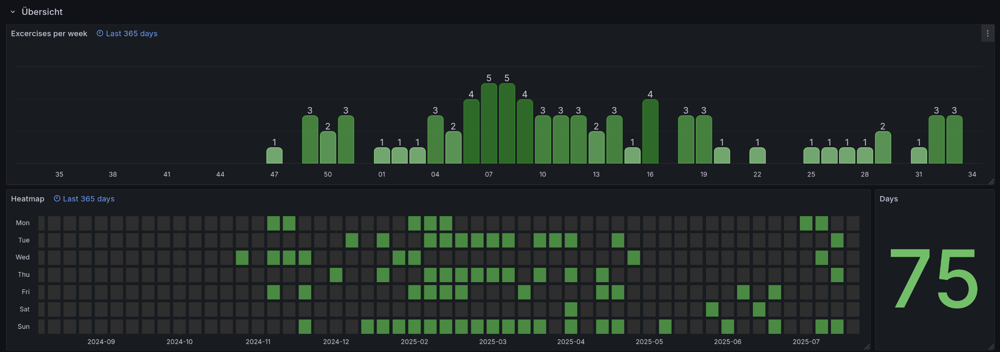

# Strong APP Workout Fetch

This is a Rust-based service to fetch workouts from the [Strong App](https://www.strong.app/) (available for [Apple](https://apps.apple.com/us/app/strong-workout-tracker-gym-log/id464254577) and [Android](https://play.google.com/store/apps/details?id=io.strongapp.strong)) and store them in a Clickhouse database.


The URL to the API backend is not provided here, for now, because it's not entirely public and because of possible legal implications.

If using docker-compose, the service will run 18:00, 18:30, 19:00, 19:30, 20:00 and 20:30, but you can change this in the `Dockerfile`.

## Why?

So you can do fun stuff with your workout data, like doing silly grafana dashboards.
For example, you can use the [Grafana Clickhouse plugin](https://grafana.com/grafana/plugins/grafana-clickhouse-datasource/) to visualize your workout data.

You can make heatmaps, like the one you have on github, or you can make a dashboard that shows your progress over time, or you can make a dashboard that shows your workout history.


You can find the Grafana JSON for the [heatmap](./examples/grafana/heatmap.json) and for the [excercises per week](./examples/grafana/excercises_per_week.json) in the [examples](./examples) folder.


## How to use

0. Have your Clckhouse database ready and running
1. Clone this repo
2. Create .env file in the root directory with the following content:
    ```ini
    STRONG_BACKEND=https://strong_backend_url.com
    
    STRONG_USER=your_strong_user
    STRONG_PASS=your_strong_pass

    CLICKHOUSE_HOST=clickhouse
    CLICKHOUSE_USER=default
    CLICKHOUSE_PASS=
    CLICKHOUSE_TABLE=strong
    ```
3. Run with `cargo run`

### Alternatively: Use Docker Compose to run the service:

1. Make sure you have Docker and Docker Compose installed.
2. Create a `.env` file in the root directory with the same content as above.
   3Start the service with `docker compose up -d`.


